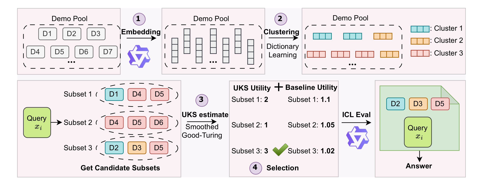

# UCS: Estimating Unseen Coverage for Improved In-Context Learning
[](https://opensource.org/licenses/MIT) [-blue)](https://aclweb.org/)

Official implementation for "UCS: Estimating Unseen Coverage for Improved In-Context Learning" accepted by ACL 2026 (Findings).

- Authors: [Jiayi Xin](https://raina-xin.github.io/), [Xiang Li](https://lx10077.github.io/), [Evan Qiang](https://openreview.net/profile?id=~Evan_Qiang1), [Weiqing He](https://openreview.net/profile?id=~Weiqing_He1), [Tianqi Shang](https://openreview.net/profile?id=~Tianqi_Shang1), [Weijie J. Su](https://www.weijie-su.com/) and [Qi Long](https://www.med.upenn.edu/long-lab/)
- Paper Link: [arxiv.org/abs/2604.12015](https://arxiv.org/abs/2604.12015)

## Overview

In-context learning (ICL) performance depends critically on which demonstrations are placed in the prompt, yet most existing selectors prioritize heuristic notions of relevance or diversity and provide limited insight into the **coverage content** of a demonstration set. We propose **UCS (Unseen Coverage Selection)**, a training-free, subset-level coverage prior motivated by the principle that a good demonstration set should *expose the model to knowledge unrevealed by the currently selected subset*.

UCS operationalizes this idea by **(1)** inducing discrete latent *coverage units* from model-consistent embeddings and **(2)** estimating the number of unrevealed units within a candidate subset via a Smoothed Good–Turing style estimator from its empirical frequency spectrum. UCS is training-free and can be seamlessly combined with both query-dependent and query-independent selection baselines via a simple regularized objective.



## Environment Setup
```shell
conda env create -f environment.yml
conda activate ucs
pip install transformers datasets accelerate huggingface_hub scikit-learn sentence-transformers
```

## Datasets

### Intent Classification
- **BANKING77**: Banking-domain intents (n=10,003)
- **CLINC150**: Large-scale multi-domain intents (n=15,000)
- **HWU64**: Fine-grained conversational intents (n=11,036)

All three datasets are loaded automatically from HuggingFace Datasets.

### Reasoning (BBEH)
- **Causal Understanding**, **Object Properties**, **Shuffled Objects** from [Big-Bench Extra Hard](https://github.com/google-deepmind/bbeh)

Place BBEH task JSON files under `bbeh/benchmark_tasks/<task_name>/task.json`.

## Usage

### Intent Classification

```bash
python main.py \
  --dataset_type banking77 \
  --model_name Qwen/Qwen2.5-7B-Instruct \
  --embedding_model_name Qwen/Qwen2.5-7B-Instruct \
  --ice_num 10 \
  --test_size 500 \
  --retrievers dpp_sgt mdl_sgt votek_sgt \
  --clustering dict_dbscan \
  --sgt_lambda 0.1 \
  --sgt_t 5.0 \
  --sgt_bin_size 20 \
  --sgt_offset 1.0 \
  --seed 42
```

### BBEH Reasoning Tasks

```bash
python main.py \
  --dataset_type bbeh \
  --bbeh_task bbeh_causal_understanding \
  --model_name Qwen/Qwen2.5-7B-Instruct \
  --embedding_model_name Qwen/Qwen2.5-7B-Instruct \
  --ice_num 10 \
  --test_size 40 \
  --retrievers dpp_sgt mdl_sgt votek_sgt \
  --clustering dict_dbscan \
  --seed 42
```

### Key Parameters

| Parameter | Description | Default |
|---|---|---|
| `--dataset_type` | Dataset: `banking77`, `clinc150`, `hwu64`, `bbeh` | `banking77` |
| `--retrievers` | Selection methods: `dpp`, `mdl`, `votek`, `dpp_sgt`, `mdl_sgt`, `votek_sgt` | — |
| `--sgt_lambda` | Weight for SGT coverage term | `0.1` |
| `--sgt_t` | SGT extrapolation factor | `5.0` |
| `--sgt_bin_size` | Binning parameter for SGT | `20` |
| `--sgt_offset` | Offset parameter for SGT (range: [1.0, 2.0]) | `1.0` |
| `--clustering` | Clustering method (`dict_dbscan` recommended) | `dict_dbscan` |

### Batch Experiments

See `scripts/` for example experiment scripts:

```bash
source scripts/run_main_all_sgt_banking77.sh
source scripts/run_main_all_sgt_clinc150.sh
source scripts/run_main_all_sgt_hwu64.sh
```

## Method Details

UCS consists of three stages:

1. **Model-Consistent Representation**: Demonstrations are embedded using the same backbone LLM used for ICL inference via masked mean pooling.
2. **Discrete Coverage Unit Induction**: Embeddings are projected into a sparse dictionary space and clustered via DBSCAN to produce discrete coverage unit IDs.
3. **SGT Coverage Estimation**: The Smoothed Good–Turing estimator is applied to the frequency spectrum of coverage units to estimate the number of unrevealed unit types.

The UCS coverage functional is defined as:

**Φ_UCS(S) = K_seen(S) + Û_t(S)**

where K_seen counts distinct observed units and Û_t estimates additional unrevealed units under continued sampling.

### UCS-Augmented Selectors

| Method | Scoring Rule |
|---|---|
| **DPP+UCS** | Greedy MAP: `argmax Δ_DPP(i|S) + λ(Φ(S∪{i}) - Φ(S))` |
| **MDL+UCS** | Subset scoring: `argmax MDL(S;x) + λΦ(S)` |
| **VoteK+UCS** | Additive: `score(i) = v(i) + λ·log(w_c)`, where w_c ∝ (ĝ_{n_c} + ε)⁻¹ |

## Acknowledgement

This repository is built upon [OpenICL](https://github.com/Shark-NLP/OpenICL). We thank the authors for their open-source contribution.

## Citation

If you find this repository helpful, please cite our paper and the OpenICL paper:
```
@article{xin2026ucs,
  title={UCS: Estimating Unseen Coverage for Improved In-Context Learning},
  author={Xin, Jiayi and Li, Xiang and Qiang, Evan and He, Weiqing and Shang, Tianqi and Su, Weijie J and Long, Qi},
  journal={arXiv preprint arXiv:2604.12015},
  year={2026}
}

@article{wu2023openicl,
  title={OpenICL: An Open-Source Framework for In-context Learning},
  author={Zhenyu Wu and Yaoxiang Wang and Jiacheng Ye and Jiangtao Feng and Jingjing Xu and Yu Qiao and Zhiyong Wu},
  journal={arXiv preprint arXiv:2303.02913},
  year={2023}
}
```

## License

This project is licensed under the MIT License - see the [LICENSE](LICENSE) file for details.
